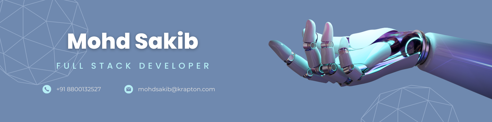

<!--  -->

<h1 align="left">Oi world, I'm Mohd Sakib</h1>
<p align="left">  </p>

<div class="github-introduction">

I am a passionate **fullstack developer** weaving intricate tapestries of code for both **web** and **mobile** realms. My journey through the digital landscape is akin to a poet's exploration of words — **each line of code a verse, each project a masterpiece**. With a profound love for technology, I craft seamless and intuitive user experiences, driven by curiosity and a relentless pursuit of innovation. From the elegance of **JavaScript** to the robustness of **React Native**, my work is a harmonious blend of creativity and technical prowess, always striving to push the boundaries of what's possible.

</div>

- 💼 Got a freelance gig? Hit me up via <a href="mailto:danishkhan9886283@gmail.com">email.</a>
- 💬 Curious? Just ask!

## 🖥️ Technologies I know and Work with


## 📈 My GitHub stats

<div class="badges-githubstats">
  <p align="center">
    
    
  </p>
</div>

<p align="center">
  
</p>

<p align="center">
  
</p>


## My Contributions

<p align="center">
  
</p>

## 📃 I love documentation

Not many developers like to write documentation. I do though. I believe that a well-documented codebase is as important as the code itself. Its like a story telling what the code can do and how it does it. I always try to write clear, concise, and useful documentation.

Whenever I write documentation i try to follow keep in mind the following steps to make sure the reader gets the most out of it:

```markdown
1. What is this documentation about?
2. Why is this documentation important?
3. How can the reader use this documentation?
4. When should the reader use this documentation?
5. Who is this documentation for?
```

### <p align="center">⚙️ My development environment </p>

> I grew up with Windows and have a special place in my heart for it. It's my go-to operating system for development. I enjoy using the Windows and the Windows Terminal. I also use <a href="https://docs.microsoft.com/en-us/powershell/" target="_blank">PowerShell</a> for my terminal.

<div class="table-devenvironment">
  <table style="font-size: 11px">
  <tr>
  <td valign="top" width="50%">
  
  #### 🖥️ Windows aficionado: 
  My development journey is powered by the robust and versatile Windows environment. From its seamless integration with tools and technologies to 
  its rich ecosystem, Windows is where my creative and technical passions come alive! 🌟

  
  
  
  
  
  
  
  
  

  </td>
  <td valign="top" width="50%">
  
  #### 🐧 Linux Enthusiast
  
  I used to work with Linux and am always open to exploring new technologies.
  
  
  
  
  </td>
  </tr>
  </table>
</div>

## Connect with me:- 
<p align="center">
  <!-- Twitter -->
<a href="https://twitter.com/itz_me_sakib" target="_blank">
  
</a>

  <!-- LinkedIn -->
  <a href="https://www.linkedin.com/in/mohdsakib001/" target="_blank">
    
  </a>

  <!-- GitHub -->
  <a href="https://github.com/mohdsakib-krapton" target="_blank">
    
  </a>

  <!-- Facebook -->
  <a href="https://www.facebook.com/profile.php?id=100024167102946" target="_blank">
    
  </a>

  <!-- Instagram -->
  <a href="https://www.instagram.com/saifi_sakib_001" target="_blank">
    
  </a>

  <!-- Email -->
  <a href="mailto:danishkhan9886283@gmail.com" target="_blank">
    
  </a>

  <!-- Portfolio -->
  <a href="https://portfolio-b4baf.web.app" target="_blank">
    
  </a>
</p>

